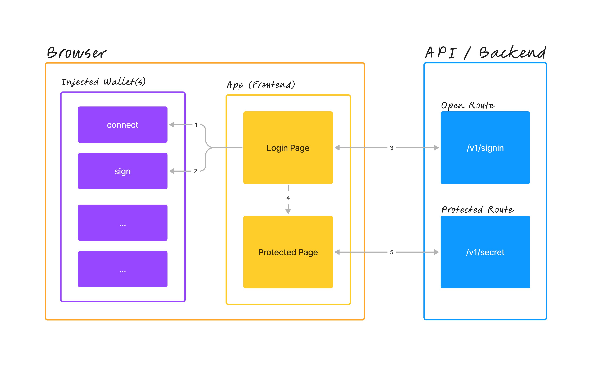

# Web3 Login

A basic app to showcase connecting to a web3 wallet and signing a message to gain access to a protected page.

## Demo

> TODO: insert gif / screen recording

## How It Works

The following steps describe the overall web3 login flow:

1. The web application requests a wallet connection to one or more accounts
2. The web application prepares a plain-text message and sends a signing request to the wallet
    * Note: The current web app implementation assumes its always the first connected account is the one doing the signing. This can be easily modified such that the user selects the account that they want to sign the message with from a dropdown. [Issue 3](https://github.com/FaisalAl-Tameemi/web3-login/issues/3).
3. Once the signature is obtained, it is sent along with the plain-text message and the account address to the API for verification. If the verification succeeds, a session cookie (JWT) is sent back from the API and stored in the browser locally.
4. The user is redirect to the protected page
    * The protection referred to here is at the UI / frontend level. This is done for UX purposes and doesn't actually protect any secure resources (that's on the API in Step 5 below).
5. A secret value is requested from the API (which verifies the session cookie) and responds back to the UI if the token is valid.

## Local Development

To run this repository locally, follow the steps below:

1. Clone the repo
2. Install dependencies with `yarn install` or your favourite package manager
    * Tested with Node version `18.x.x` and `19.x.x`
3. Install a browser wallet (such as [PolkadotJS](https://polkadot.js.org/extension/) or [Talisman](https://www.talisman.xyz/))
    * Other wallets should also work but haven't been tested.
4. Open `localhost:3000` on in a browser window

## Deployment

> TODO: ...

